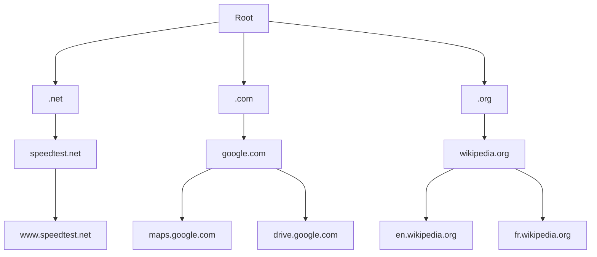
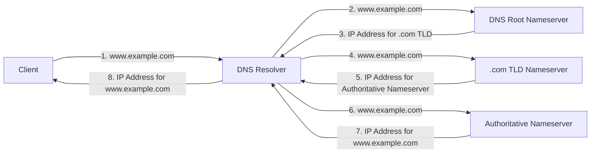

In this post, I'll go over fundamentals of Domain Name System (DNS). The content below is not meant to be a deep dive into the inner workings of DNS but is meant more as a gentle introduction for beginners or a quick refresher for those of us returning to the world of networking and cybersecurity after a prolonged absence. 

> Over the last year, I have been meaning to get back into cybersecurity but as life would have it, I couldn't dedicate much time without detracting from existing obligations and responsibilities. The last month has seen an increase in my leisure time and as such I have finally been able to devote some time and resources to refamiliarise myself with the field.

## What is DNS?

DNS resolves domain names of internet sites with their underlying IP addresses. DNS is analogous to a phone book for the internet whereby it permits translation of human-friendly hostnames into IP addresses.

DNS is hierarchical and decentralized. The directory of registered domains is distributed around the world on domain name servers that communicate with each other on a regular basis to provide updates and eliminate redundancies. The distributed nature serves to improve performance and reliability.

## How does DNS Work?

To understand the process behind DNS resolution, it is important to know the different types of DNS servers involved in the translation. A URL request goes through four servers for the IP address to be resolved. These servers work with each other to resolve hostname to an IP address.

### _DNS Recursor_

DNS recursor servers (also known as DNS resolvers or recursive resolvers) are designed to receive hostname queries (`www.example.com`) from client machines and are the first servers to be contacted as a result of a URL request from a client. These servers are typically operated by ISPs.

After receiving a request from a client, a DNS resolver emulates a client itself and makes queries to the other three DNS servers. DNS resolvers communicate with other DNS servers and check the records attained from authoritative DNS servers for associated IP addresses.

Upon receiving a hostname request, the DNS resolver starts by looking in its local cache or that of the operating system on the client device. If the hostname is found within the cache, it is resolved immediately. If the hostname is not found, the DNS resolver contacts the DNS root server to continue the DNS resolution process.

### _Root Nameserver_

Root nameservers are the root of the DNS hierarchy and serve as a reference to other more specific locations. Root nameservers answer requests by sending back the IP addresses of the appropriate top level domain nameservers.

For example, in order to translate `www.example.com`, a resolver first needs to figure out where `.com` lives, followed by `example.com`, followed by `www.example.com`. The authoritative nameservers that DNS resolvers use to find top level domains like `.com` are called the root nameservers.

The root nameservers contain information that makes up the root zone. The root zone contains all the names and IP addresses of all top level domains. The root zone contains information on:

* Generic top level domains such as `.com, .net, .io, etc.`
* Country code top level domains such as `.ca for Canada` or `.jp for Japan`.
* Internationalized top level domains

Note that DNS resolvers cannot be directed directly to root zones during a DNS lookup and as such have a list of 13 IP root server addresses built into their software. Whenever a DNS lookup is initiated, the DNS resolver's first communication is with one of the 13 hardcoded IP addresses.

The DNS system will route DNS requests to the closest geographical root nameserver. The root zone comes from the Internet Assigned Numbers Authority (IANA), which is part of the Internet Corporation for Assigned Names and Numbers (ICANN). It is signed using DNSSEC signatures to ensure authenticity, and issued to the root server operators to publish to their root servers.

### _Top Level Domain Nameserver (TLD)_

Top level domain nameservers contains information for all domain names that share a common domain extension such as `.com, .net, etc`.

A TLD nameserver keeps the IP address of the second-level domain (`example.com`) contained within the TLD name (`.com`). In other words, a `.com` TLD nameserver contains IP addresses of every website that ends in `.com`.

During DNS resolution, TLD nameservers are tasked with returning the IP address of the authoritative nameserver for the requested hostname.

### _Authoritative Nameserver_

Authoritative nameservers are the final stop in the DNS resolution process. An authoritative nameserver takes the domain name and subdomain and returns the correct IP address to the DNS resolver. Note that this only happens if the authoritative nameserver in question has access to appropriate DNS records. 

In some cases, an authoritative nameserver will route the DNS resolver to another nameserver that contains specific DNS records for a subdomain (`support.example.com`).

Authoritative nameservers are split into two types: a master server or primary nameserver and a slave server or secondary nameserver. The primary nameserver keeps the original copies of the zone records while the secondary nameserver keeps a copy. This allows the secondary nameservers to share the DNS server load and act as a backup if the primary nameserver fails.

### _Summary of the DNS Resolution Process:_

1. A client requests a human readable hostname such as `www.example.com`. The request is routed to DNS resolver.
2. The DNS resolver routes the request for `www.example.com` to the DNS root nameserver.
3. DNS root nameserver returns the IP address for `.com` TLD nameserver.
4. The DNS resolver routes the request for `www.example.com` to the `.com` TLD nameserver.
5. The `.com` TLD nameserver returns the IP address for the authoritative nameserver that holds the current details for `www.example.com`.
6. The DNS resolver routes the request for `www.example.com` to the authoritative nameserver.
7. The authoritative nameserver looks in the `example.com` hosted zone for the `www.example.com` record and returns the associated IP address for the hostname to the DNS resolver.
8. The DNS resolver returns the IP address for the requested hostname to the client thus permitting the client to connect to the server and start communicating with it.

## Types of DNS Queries

During the DNS lookup process, there are three types of DNS queries: recursive query, iterative query, and non-recursive query. Note that an uncached DNS lookup will involve both recursive and iterative queries.

1. **Recursive query** - DNS server (typically a DNS resolver) requires that a DNS resolver respond to the client with either the requested resource record or an error message if the record cannot be found.
2. **Iterative query** - DNS client allows DNS server to return the best answer it can. If the DNS server does not have a match for the hostname, it returns a referral to an authoritative nameserver. The client then queries the authoritative nameserver. This process continues with additional DNS servers until an error or a timeout occurs.
3. **Non-recursive query** - DNS resolver immediately returns a DNS record because the DNS record already exists in the DNS resolver's cache or queries an authoritative nameserver for the record.

## DNS Caching

DNS caching improves reliability and performance while reducing DNS traffic across the internet. DNS caching allows any DNS server or client to locally store information about previous DNS lookup requests (such as DNS records). This allows DNS queries to be resolved immediately without requiring recursive DNS queries.

DNS records are stored in cache for a period of time called **time to live** (TTL) which is defined in the configuration of each DNS record.

The following subsections cover several layers where DNS records can be cached.

### _Browser DNS Caching_

Modern web browsers are designed to cache DNS records for a set amount of time. When a DNS record request is made, the browser cache is the first location checked for the requested record. This enables immediate DNS request resolution without needing to contact external DNS servers.

### _OS DNS Caching_

All operating systems come with DNS resolvers known as stub resolvers. Stub resolvers are the second place where a DNS query can be resolved before it leaves a client's machine.

When a DNS request is made, the stub resolver checks its internal cache to see if the record exists. If the record exists, the DNS request is resolved immediately. If the DNS record does not exist in the cache, the stub resolver sends a DNS query (with a recursive flag set) to an external DNS resolver.

### _Recursive Resolver DNS Caching_

When a DNS query is routed to a DNS resolver, the resolver checks its local cache to see if the requested if the hostname-to-IP translation already exists.

The DNS resolver has additional functionality depending on the type of records it has in its cache:

1. If the DNS resolver has the NS records for the authoritative nameservers but does not have A records (the specific IP addresses), the resolver will query those authoritative nameservers directly. This prevents DNS lookups from the root and associated TLD nameservers.
2. If the DNS resolver does not have the NS records, it will query the respective TLD nameserver bypassing the root nameserver.
3. If the DNS resolver does not have records pointing to the TLD nameservers, it will query the root nameserver. This typically occurs after a DNS cache has been purged.

## DNS Record Types

DNS records (or DNS resource records) provide basic information about hosts and are stored in the zone files on the DNS server.

The following are common types of DNS records:

1. **DNS A records** - DNS A records (or Address Mapping records) hold a hostname and its corresponding IPV4 address. An example of a DNS A record is presented below.

    |Domain|TTL (s)|Record Type|Value|
|:-:|:-:|:-:|:-:|
|example.com|14400|A|192.0.0.1|

2. **DNS AAAA records** - DNS AAAA records hold a hostname and its corresponding IPV6 address.
3. **DNS CNAME records** - DNS CNAME records (or Canonical Name records) are used to create aliases of domain names. CNAME records can be used to alias one domain to another domain. All CNAME records must point to a domain and never to an IP address. A common example is subdomain which is provided an alias to the root domain name.  

    An example of a DNS CNAME record is presented below where `support.example.com` is an alias for `example.com`. When a DNS A record lookup is requested for `support.example.com`, the DNS resolver will see a CNAME record and return the IP address for `example.com` instead.

    |Domain|TTL (s)|Record Type|Value|
|:-:|:-:|:-:|:-:|
|support.example.com|14400|CNAME|example.com|

4. **DNS MX records** - DNS MX record (or Mail Exchanger records) specifies a mail exchange server that routes emails to the correct mail server for the domain. MX records indicate how emails should be routed in accordance with SMTP. DNS MX records must point to another domain and never to an IP address.  

   Priority numbers are used to indicate preference for a server where **lower priority numbers are preferred over higher priority numbers**. When two or more exchange servers are included in the MX record, the priority can be set to be equal in order to enable load balancing between the mail servers. An example of a DNS MX record is presented below. 
   
    |Domain|TTL (s)|Record Type|Priority|Value|
|:-:|:-:|:-:|:-:|:-:|
|example.com|3600|MX|0|mailhost@example.com|

5. **DNS NS records** - DNS NS records (or Name Server records) delegates a DNS zone to use a specific authoritative nameserver. When querying a domain, NS records provide a list of authoritative nameservers for that domain. Note that DNS NS records can never point to a CNAME record. An example of a DNS NS record is presented below.
   
    |Domain|TTL (s)|Record Type|Value|
|:-:|:-:|:-:|:-:|
|example.com|14400|NS|ns1.exampleserver.com|

6. **DNS PTR records** - DNS PTR records (or Reverse-lookup Pointer records) map a domain name associated with an IP address for reverse DNS lookups. DNS PTR records are used to lookup domain names based on an IP address (opposite of DNS A records).

7. **DNS CERT records** - DNS CERT records (or Certificate records) store encryption certificates (such as PGP, PKIX, SPKI, etc.) and related certificate revocation lists (CRLs) for invalid certificates. 
   To create a CERT record, the following information must be provided:
   * Certificate type
   * Key tag
   * Encryption algorithm
   * Certificate, CRL, URL of the certificate, or fingerprint and a URL together.
     An example of a DNS CERT record is presented below.
 
    |Domain|TTL (s)|Record Type|Value|
|:-:|:-:|:-:|:-:|
|example.com|300|CERT|2 77 2 TUlJQ1l6Q0NBY3lnQXdJQkFnSUJBREFOQmdrcWh|

8. **DNS TXT records** -  DNS TXT records (or Text records) are used to store descriptive texts which often contain additional information which may not fit the format of other records. An example of a DNS TXT record is presented below.
   
    |Domain|TTL (s)|Record Type|Value|
|:-:|:-:|:-:|:-:|
|example.com|14400|TXT|Some text|

The list of DNS records presented above is non-exhaustive. For a complete list refer to [DNS Record Types Explained](https://phoenixnap.com/kb/dns-record-types "DNS Record Types Explained").

## DNS Message Format

DNS communication is facilitated using query and reply messaging. Both queries and responses have the same general format consisting of a header and four sections including question, answer, authority, and an additional space. 

### _Header Section_

The header field controls the contents of these four sections. The general format of DNS message header is illustrated below.

| Field name | No. of Bits | Description                                                                                                                                                                                                                                                                                                                                                                                                                                                                                                                                                                                                                                                                                                                                                                                                                                                                                                                                                                                                                                                                                                                                       |
| ---------- | ----------- | ------------------------------------------------------------------------------------------------------------------------------------------------------------------------------------------------------------------------------------------------------------------------------------------------------------------------------------------------------------------------------------------------------------------------------------------------------------------------------------------------------------------------------------------------------------------------------------------------------------------------------------------------------------------------------------------------------------------------------------------------------------------------------------------------------------------------------------------------------------------------------------------------------------------------------------------------------------------------------------------------------------------------------------------------------------------------------------------------------------------------------------------------- |
| ID         | 16          | **_Identifier_**: An identification field generated by the devices that creates the DNS query. The ID field is used to match responses with queries.                                                                                                                                                                                                                                                                                                                                                                                                                                                                                                                                                                                                                                                                                                                                                                                                                                                                                                                                                                                              |
| QR         | 1           | **_Query/Response Flag_**: Differentiates between a query (0) or a reply (1).                                                                                                                                                                                                                                                                                                                                                                                                                                                                                                                                                                                                                                                                                                                                                                                                                                                                                                                                                                                                                                                                     |
| OPCODE     | 4           | **_Query_**: A standard query. (OPCODE 0)   **_IQUERY_**: An inverse query. (OPCODE 1)   **_STATUS_**: A server status request. (OPCODE 2)   **_RESERVED_**: Reserved/not used. (OPCODE 3)   **_NOTIFY_**: Used by primary server to notify secondary server that data for a zone has changed and request a zone transfer. (OPCODE 4)   **_UPDATE_**: A special message type to implement dynamic DNS. Allows resource records to be added, deleted, or updated selectively. (OPCODE 5)   **_DNS State Operations (DSO)_**: Used to communicate operations within persistent stateful sessions. (OPCODE 6)   **_OPCODES 7-15_**: Unassigned.                                                                                                                                                                                                                                                                                                                                                                                                                                                                                 |
| AA         | 1           | **_Authoritative Answer Flag_**: Set to `TRUE or 1` if the DNS server that created the response is authoritative for the queried hostname.                                                                                                                                                                                                                                                                                                                                                                                                                                                                                                                                                                                                                                                                                                                                                                                                                                                                                                                                                                                                        |
| TC         | 1           | **_Truncate Flag_**: Set to `TRUE or 1` if the message was truncated due to excessive length. UDP messages are limited to 512 bytes while TCP does not have a length limit for messages.                                                                                                                                                                                                                                                                                                                                                                                                                                                                                                                                                                                                                                                                                                                                                                                                                                                                                                                                                          |
| RD         | 1           | **_Recursion Desired_**: When set to `TRUE or 1`, requests the server receiving the DNS query to answer the query recursively.                                                                                                                                                                                                                                                                                                                                                                                                                                                                                                                                                                                                                                                                                                                                                                                                                                                                                                                                                                                                                    |
| RA         | 1           | **_Recursion Available_**: When set to `TRUE or 1` in a response, indicates that the replying DNS server supports recursion.                                                                                                                                                                                                                                                                                                                                                                                                                                                                                                                                                                                                                                                                                                                                                                                                                                                                                                                                                                                                                      |
| Z          | 3           | **_Zero_**: Reserved for future. Value set to `FALSE or 0`.                                                                                                                                                                                                                                                                                                                                                                                                                                                                                                                                                                                                                                                                                                                                                                                                                                                                                                                                                                                                                                                                                       |
| RCODE      | 4           | Set to `FALSE or 0` in queries. This field indicates if the query was answered successfully or if an error occured.     **_No Error_**: No error occured. (RCODE 0)   **_Format Error_**: Server unable to respond due to a problem with how the query was constructed. (RCODE 1)   **_Server Failure_**: Server was unable to respond to the query due to an issue with the server itself. (RCODE 2)   **_Name Error_**: The name specified in the query does not exist in the domain. (RCODE 3)   **_Not Implemented_**: The type of query received is not supported by the sever. (RCODE 4)   **_Refused_**: Server refused to process query. (RCODE 5)   **_YX Domain_**: A name exists when it should not. (RCODE 6)   **_YX RR Set_**: A resource record set exists that should not. (RCODE 7)   **_NX RR Set_**: A resource record set that should exist but does not. (RCODE 8)   **_Not Auth_**: The server receiving the query is not authoritative for the zone specified. (RCODE 9)   **_Not Zone_**: A name specified in the message is not within the zone specified in the message. (RCODE 10) |
| QDCount    | 16          | **_Question Count_**: Specifies the number of questions in the _Question_ section of the message.                                                                                                                                                                                                                                                                                                                                                                                                                                                                                                                                                                                                                                                                                                                                                                                                                                                                                                                                                                                                                                                 |
| ANCount    | 16          | **_Answer Record Count_**: Specifies the number of resource records in the _Answer_ section of the message.                                                                                                                                                                                                                                                                                                                                                                                                                                                                                                                                                                                                                                                                                                                                                                                                                                                                                                                                                                                                                                       |
| NSCount    | 16          | **_Authority Record Count_**: Specifies the number of resource records in the _Authority_ section of the message.                                                                                                                                                                                                                                                                                                                                                                                                                                                                                                                                                                                                                                                                                                                                                                                                                                                                                                                                                                                                                                 |
| ARCount    | 16          | **_Additional Record Count_**: Specifies the number of resource records in the _Additional_ section of the message                                                                                                                                                                                                                                                                                                                                                                                                                                                                                                                                                                                                                                                                                                                                                                                                                                                                                                                                                                                                                                |

### _Question Section_

The question section contains the domain name and the type of DNS record being resolved. The question section contain the following fields:

| Field | Length (bytes) | Description                    |
| ----- | -------------- | ------------------------------ |
| NAME  | 2              | Name of the requested resource |
| TYPE  | 2              | Type of DNS resource record    |
| CLASS | 2              | Class code                     |

### _Answer Section_

The answer section contains the DNS resource records of the queried hostname.

## DNS Transport Protocol

DNS queries consist of a single request packet from a client followed by a single response packet from the DNS server. Transmission occurs over UDP on port 53. For DNS queries, use of UDP is advantageous as it offers speed advantages with low overhead compared to TCP.

UDP packets cannot be greater than 512 bytes in size. If a DNS response exceeds 512 bytes and Extension Mechanisms for DNS (EDNS) is not supported by the client or the server, then DNS queries are transmitted using TCP on port 53. It should be noted that DNS will always utilize TCP for zone transfer.
